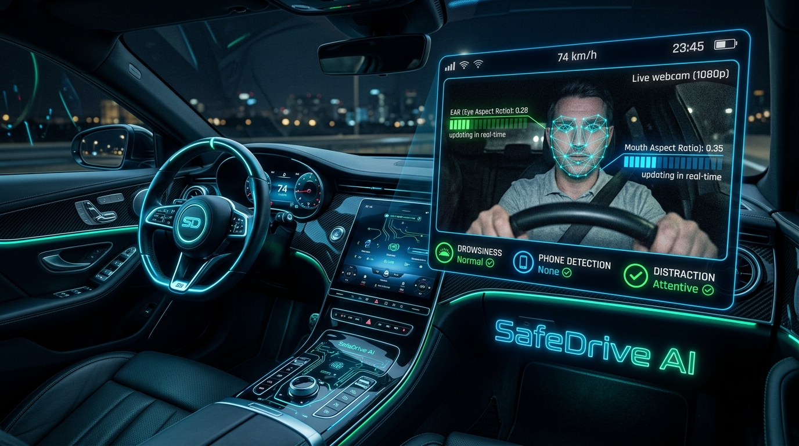

<div align="center">



<br/>

```
███╗   ██╗███████╗██╗  ██╗██╗   ██╗███████╗      ██████╗ ███╗   ███╗███████╗
████╗  ██║██╔════╝╚██╗██╔╝██║   ██║██╔════╝      ██╔══██╗████╗ ████║██╔════╝
██╔██╗ ██║█████╗   ╚███╔╝ ██║   ██║███████╗█████╗██║  ██║██╔████╔██║███████╗
██║╚██╗██║██╔══╝   ██╔██╗ ██║   ██║╚════██║╚════╝██║  ██║██║╚██╔╝██║╚════██║
██║ ╚████║███████╗██╔╝ ██╗╚██████╔╝███████║      ██████╔╝██║ ╚═╝ ██║███████║
╚═╝  ╚═══╝╚══════╝╚═╝  ╚═╝ ╚═════╝ ╚══════╝      ╚═════╝ ╚═╝     ╚═╝╚══════╝
```

### **Multimodal AI Framework for Real-Time Driver Vigilance Monitoring**

*The world's most capable open-source Driver Monitoring System.*

<br/>

[](https://python.org)
[](https://mediapipe.dev)
[](https://ultralytics.com)
[](https://opencv.org)
[](https://twilio.com)
[](https://flask.palletsprojects.com)

<br/>


<br/>

---

<br/>

> ### *"100,000 crashes. 71,000 injuries. 1,550 deaths. Every single year.*
> *NEXUS-DMS was built so the next one never happens."*

<br/>

</div>

---

## 📋 Table of Contents

<details>
<summary><b>Click to expand full table of contents</b></summary>

| # | Section | Description |
|---|---------|-------------|
| 1 | [The Problem](#-the-problem) | Why NEXUS-DMS exists |
| 2 | [Overview](#-overview) | What the system does |
| 3 | [Feature Showcase](#-feature-showcase) | Complete capability breakdown |
| 4 | [System Architecture](#-system-architecture) | Full pipeline design |
| 5 | [Detection Engine](#-detection-engine--algorithms) | AI models & math |
| 6 | [Alert Escalation](#-alert-escalation-pipeline) | Staged response logic |
| 7 | [SMS Alert Format](#-sms-alert-format--gps) | Real message examples |
| 8 | [Project Structure](#-project-structure) | All files explained |
| 9 | [Installation](#-installation) | Step-by-step setup |
| 10 | [Configuration](#️-configuration) | Every setting explained |
| 11 | [Usage](#-usage) | How to run it |
| 12 | [Performance](#-performance) | Benchmarks & metrics |
| 13 | [Changelog](#-changelog-v200) | What changed and why |
| 14 | [Tech Stack](#-tech-stack) | Full technology table |
| 15 | [Roadmap](#-future-roadmap) | What's coming next |

</details>

---

## 🚨 The Problem

<table>
<tr>
<td align="center" width="33%">

### 😴 Drowsy Driving
**100,000** crashes/year  
**71,000** injuries/year  
**1,550** fatalities/year  
*— NHTSA, United States*

</td>
<td align="center" width="33%">

### 📱 Distracted Driving
**25%** of all road deaths  
**3,000+** lives/year  
**400,000** injuries/year  
*— WHO Global Report*

</td>
<td align="center" width="33%">

### 🌍 Global Impact
**1.35 million** deaths/year  
Road accidents cost **3% of GDP**  
\#8 leading cause of death worldwide  
*— WHO Road Safety Report*

</td>
</tr>
</table>

**The root cause?** Existing vehicle safety systems react *after* the accident. Seatbelts and airbags are reactive. NEXUS-DMS is **predictive** — it detects the impairment before the crash ever happens.

---

## 🌟 Overview

**NEXUS-DMS** (*Neuromorphic EXpert Unified Surveillance — Driver Monitoring System*) is a production-grade, AI-powered vigilance monitoring framework that operates **entirely in real-time** using a standard webcam. No proprietary hardware. No cloud dependency for inference. No subscription fees.

It fuses **two of the world's most capable computer vision frameworks** into a single unified pipeline:

- 🔬 **Google MediaPipe Face Mesh** — 468-point facial landmark graph for sub-millimeter EAR/MAR computation
- ⚡ **Ultralytics YOLOv8** — State-of-the-art single-shot object detector for mobile phone recognition

The result is a system that **sees what you see, in real time**, and responds before it's too late.

### How It Works — 30 Seconds

```
You close your eyes
      │
      ▼  t = 2s   →  🔊 "Warning. Driver appears drowsy."
      ▼  t = 3.5s →  🔔 Buzzer alarm activates — loud, persistent
      ▼  t = 5s   →  📲 Emergency SMS fired to your phone
                        📍 Chennai, Tamil Nadu, India
                           Maps: maps.google.com/?q=13.0895,80.2739
You open your eyes
      │
      ▼  Alarm stops. System resets. Monitoring resumes.
```

---

## ✨ Feature Showcase

### 🧠 Core Detection Capabilities

<table>
<tr>
<th>Feature</th>
<th>AI Engine</th>
<th>Method</th>
<th>Trigger Condition</th>
<th>Response</th>
</tr>
<tr>
<td>😴 <b>Drowsiness</b></td>
<td>MediaPipe FaceMesh</td>
<td>Eye Aspect Ratio (EAR) — 6 landmarks per eye</td>
<td>EAR &lt; 0.25 for 15 consecutive frames</td>
<td>Voice → Buzzer → SMS + GPS</td>
</tr>
<tr>
<td>🥱 <b>Yawn Detection</b></td>
<td>MediaPipe FaceMesh</td>
<td>Mouth Aspect Ratio (MAR) — 8 landmarks</td>
<td>MAR &gt; 0.65</td>
<td>Screenshot + event logged</td>
</tr>
<tr>
<td>👀 <b>Distraction</b></td>
<td>MediaPipe FaceMesh</td>
<td>5-point head pose estimation</td>
<td>Nose deviation &gt; 3% of face width</td>
<td>Voice + Screenshot + SMS + GPS</td>
</tr>
<tr>
<td>📱 <b>Phone Usage</b></td>
<td>YOLOv8 (COCO)</td>
<td>Class 67 detection + 3 false-positive guards</td>
<td>Confidence ≥ 50% + passes all filters</td>
<td>Voice + SMS + GPS</td>
</tr>
</table>

### 🚨 Alert System

<table>
<tr>
<th>Alert Type</th>
<th>Technology</th>
<th>Behaviour</th>
</tr>
<tr>
<td>🔊 <b>Voice Warning</b></td>
<td>pyttsx3 — threaded TTS</td>
<td>Non-blocking; runs in background thread; immediate</td>
</tr>
<tr>
<td>🔔 <b>Buzzer Alarm</b></td>
<td>Pygame audio engine</td>
<td>Looping alarm — stays ON until driver opens eyes</td>
</tr>
<tr>
<td>📲 <b>Emergency SMS</b></td>
<td>Twilio REST API</td>
<td>City + State + Country + Coordinates + Maps link + Timestamp</td>
</tr>
<tr>
<td>📸 <b>Evidence Capture</b></td>
<td>OpenCV imwrite</td>
<td>Auto-saves timestamped JPEG on every alert event</td>
</tr>
<tr>
<td>🗺️ <b>GPS Location</b></td>
<td>ip-api.com → ipinfo.io → geocoder</td>
<td>3-source cascade — city-level accuracy, Maps link included</td>
</tr>
</table>

### 🛡️ Anti-False-Positive System (Phone Detection)

| Guard | Logic | What It Prevents |
|---|---|---|
| **Face Overlap (IoU > 35%)** | Detection box intersects face region | Yawning open mouth being classified as phone |
| **Aspect Ratio (W > 2×H)** | Wide boxes rejected | Hands, arms, and mouth shapes |
| **Minimum Area (< 0.2% frame)** | Tiny detections rejected | Background noise, reflections |
| **Yawn Suppression** | Phone detection disabled while MAR > threshold | Entire false trigger during active yawn |
| **Confidence Floor (≥ 50%)** | Low-confidence detections rejected | Uncertain, partial detections |

---

## 🏗️ System Architecture

```
╔══════════════════════════════════════════════════════════════════════════════╗
║                                                                              ║
║                       NEXUS-DMS v2.0  —  Full Pipeline                      ║
║                                                                              ║
╠══════════════════════════════════════════════════════════════════════════════╣
║                                                                              ║
║   ┌─────────────────────────────────────────────────────────────────────┐   ║
║   │                    STARTUP: Phone Registration                      │   ║
║   │            Tkinter GUI  →  validates number  →  stores contact      │   ║
║   └─────────────────────────────┬───────────────────────────────────────┘   ║
║                                 │                                            ║
║                                 ▼                                            ║
║   ┌───────────────────────────────────────────────────────────────────────┐  ║
║   │  Camera Module  (OpenCV VideoCapture)                                 │  ║
║   │  Resolution: 640×480  │  Target: 30 FPS  │  Index: configurable      │  ║
║   └──────────────┬──────────────────────────────────┬─────────────────────┘  ║
║                  │ BGR Frame                        │ BGR Frame              ║
║                  ▼                                  ▼                        ║
║   ┌──────────────────────────┐          ┌───────────────────────────────┐   ║
║   │    Face Analyzer         │          │      Phone Detector           │   ║
║   │  MediaPipe FaceMesh      │          │   YOLOv8  (COCO class 67)     │   ║
║   │  468 landmarks @ 30fps   │          │   + 5-layer false-pos filter  │   ║
║   └───────────┬──────────────┘          └────────────────┬──────────────┘   ║
║               │                                          │                   ║
║     FaceData object                              phone_boxes list            ║
║     (landmarks, EAR pts,                         (x1,y1,x2,y2,conf)         ║
║      MAR pts, nose, head)                                │                   ║
║               │                                          │                   ║
║      ┌────────┼──────────────────┐                       │                   ║
║      ▼        ▼                  ▼                       │                   ║
║  ┌────────┐ ┌──────────┐ ┌────────────────────┐         │                   ║
║  │Drowsy  │ │  Yawn    │ │  Distraction       │         │                   ║
║  │Detector│ │Detector  │ │  Detector          │         │                   ║
║  │  EAR   │ │  MAR     │ │  Head Pose         │         │                   ║
║  └───┬────┘ └────┬─────┘ └──────────┬─────────┘         │                   ║
║      │           │                  │                    │                   ║
║      └───────────┴──────────────────┴────────────────────┘                  ║
║                                     │                                        ║
║                                     ▼                                        ║
║   ┌───────────────────────────────────────────────────────────────────────┐  ║
║   │                         Alert Manager                                 │  ║
║   │                                                                       │  ║
║   │   State machine per alert type  │  Cooldown timers  │  GPS resolver   │  ║
║   │                                                                       │  ║
║   │    ┌──────────┐   ┌──────────┐   ┌─────────────────────────────────┐ │  ║
║   │    │ pyttsx3  │   │ Pygame   │   │ Twilio SMS                      │ │  ║
║   │    │  Voice   │   │ Buzzer   │   │  + ip-api.com / ipinfo.io GPS   │ │  ║
║   │    │  TTS     │   │  Alarm   │   │  + Google Maps deep-link        │ │  ║
║   │    └──────────┘   └──────────┘   └─────────────────────────────────┘ │  ║
║   └───────────────────────────────────────────────────────────────────────┘  ║
║                                                                              ║
║   ┌───────────────────────────────────────────────────────────────────────┐  ║
║   │  Event Logger  →  logs/alerts.csv  (timestamped, all events)          │  ║
║   │  Flask Dashboard  →  http://127.0.0.1:5000  (analytics, charts)       │  ║
║   └───────────────────────────────────────────────────────────────────────┘  ║
║                                                                              ║
╚══════════════════════════════════════════════════════════════════════════════╝
```

---

## 🔬 Detection Engine & Algorithms

### Eye Aspect Ratio (EAR) — Drowsiness Detection

The EAR formula uses **6 facial landmarks** per eye (MediaPipe indices `33, 160, 158, 133, 153, 144` for left; `362, 385, 387, 263, 373, 380` for right) to compute the ratio of vertical to horizontal eye opening:

$$EAR = \frac{\|p_2 - p_6\| + \|p_3 - p_5\|}{2 \cdot \|p_1 - p_4\|}$$

Where $p_1 \ldots p_6$ are the six eye landmark coordinates in Euclidean space.

| EAR Value | Interpretation |
|---|---|
| `≥ 0.25` | Eyes fully open — driver alert |
| `0.15 – 0.24` | Eyes partially closed — warning zone |
| `< 0.15` | Eyes closed — immediate alert |
| Sustained `< 0.25` for 15 frames | **DROWSY confirmed** |

---

### Mouth Aspect Ratio (MAR) — Yawn Detection

The MAR uses **8 mouth landmark points** to measure vertical mouth opening relative to width:

$$MAR = \frac{\|p_2 - p_8\| + \|p_3 - p_7\| + \|p_4 - p_6\|}{3 \cdot \|p_1 - p_5\|}$$

| MAR Value | Interpretation |
|---|---|
| `< 0.65` | Mouth closed / normal speech |
| `≥ 0.65` | **YAWN detected** |

---

### Head Pose Estimation — Distraction Detection

Using **4 facial key-points** (nose tip, face center, forehead, chin), NEXUS-DMS computes head orientation without expensive 3D model fitting:

**Horizontal distraction:**

$$\Delta_x = \frac{x_{nose} - x_{center}}{x_{right} - x_{left}}$$

If $|\Delta_x| > 0.03$ → driver looking **LEFT** or **RIGHT**

**Vertical distraction:**

$$r_{vert} = \frac{y_{nose} - y_{forehead}}{y_{chin} - y_{forehead}}$$

If $r_{vert} \notin [0.42, 0.58]$ → driver looking **UP** or **DOWN**

---

### YOLOv8 Phone Detection — False Positive Pipeline

Standard YOLOv8 at 30% confidence produces high false positive rates for phones when drivers yawn or raise their hands. NEXUS-DMS applies a **5-layer filtering cascade**:

```
Raw YOLO Output (class=67, conf≥0.50)
           │
           ▼
  ┌─────────────────────────┐
  │ Filter 1: Aspect Ratio  │  Width > 2× Height ?  →  REJECT (hand/mouth shape)
  └─────────────┬───────────┘
                │ PASS
                ▼
  ┌─────────────────────────┐
  │ Filter 2: Min Area      │  Area < 0.2% frame ?  →  REJECT (noise)
  └─────────────┬───────────┘
                │ PASS
                ▼
  ┌─────────────────────────┐
  │ Filter 3: Face IoU      │  IoU(det, face_box) > 0.35 ?  →  REJECT (mouth/face)
  └─────────────┬───────────┘
                │ PASS
                ▼
  ┌─────────────────────────┐
  │ Filter 4: Yawn Gate     │  MAR > 0.65 ?  →  SUPPRESS ALL phone detections
  └─────────────┬───────────┘
                │ PASS
                ▼
          VALID PHONE DETECTION → alert triggered
```

---

## 🚨 Alert Escalation Pipeline

### 😴 Drowsiness — Full Escalation Sequence

```
t = 0.0s  │  EAR drops below 0.25 — drowsy timer starts
           │
t = 2.0s  │  ┌─────────────────────────────────────────────────────────┐
           │  │  🔊 VOICE WARNING (background thread, non-blocking)     │
           │  │  "Warning. Driver appears drowsy. Please stay alert."   │
           │  └─────────────────────────────────────────────────────────┘
           │
t = 3.5s  │  ┌─────────────────────────────────────────────────────────┐
           │  │  🔔 BUZZER ALARM (Pygame, looping indefinitely)         │
           │  │  Stays ON until driver opens eyes — does NOT stop       │
           │  │  after SMS fires — driver must respond to silence it    │
           │  └─────────────────────────────────────────────────────────┘
           │
t = 5.0s  │  ┌─────────────────────────────────────────────────────────┐
           │  │  📲 EMERGENCY SMS — sent via Twilio to registered #     │
           │  │  📸 Screenshot captured and saved to screenshots/       │
           │  │  🔊 Voice: "Critical alert. Emergency contact notified." │
           │  └─────────────────────────────────────────────────────────┘
           │
t = ?     │  Driver opens eyes → reset_drowsy() called
           │  Buzzer stops. Timer resets. System returns to ATTENTIVE.
```

### 📱 Phone Detection — Response Sequence

```
t = 0.0s  │  Phone detected (passes all 5 filters, confidence ≥ 50%)
           │  ┌─────────────────────────────────────────────────────────┐
           │  │  🔊 VOICE WARNING (immediate)                           │
           │  │  "Warning. Mobile phone detected. Focus on the road."   │
           │  └─────────────────────────────────────────────────────────┘
           │
t = 5.0s  │  ┌─────────────────────────────────────────────────────────┐
           │  │  📲 SMS sent with GPS + timestamp + Maps link           │
           │  │  📸 Screenshot captured                                 │
           │  └─────────────────────────────────────────────────────────┘
           │
t = ?     │  Phone removed from frame → alert state reset
```

### 👀 Distraction — Response Sequence

```
t = 0.0s  │  Head turned away from road (threshold exceeded)
           │
t = 3.0s  │  ┌─────────────────────────────────────────────────────────┐
           │  │  🔊 VOICE WARNING                                       │
           │  │  "Driver distraction detected. Keep eyes on the road."  │
           │  │  📸 Screenshot captured                                 │
           │  │  📲 SMS sent with direction + GPS + timestamp           │
           │  └─────────────────────────────────────────────────────────┘
           │
t = ?     │  Head returns to center → distraction state reset
```

---

## 📲 SMS Alert Format & GPS

NEXUS-DMS uses a **three-provider GPS cascade** for maximum reliability:

```
Priority 1: ip-api.com   →  City + State + Country + Lat/Lng  (most detailed)
Priority 2: ipinfo.io    →  City + Region + Lat/Lng           (reliable fallback)
Priority 3: geocoder     →  Lat/Lng only                       (last resort)
```

Every SMS delivers the **full address**, **4-decimal-place coordinates**, **Google Maps deep-link**, and **local timestamp** of the incident.

---

### 🚨 Drowsy Emergency Alert

```
╔══════════════════════════════════════╗
║  🚨 NEXUS-DMS — EMERGENCY ALERT      ║
║  ━━━━━━━━━━━━━━━━━━━━━━━━━━━━━━━━━━ ║
║  ⚠ Driver unresponsive for 5s!       ║
║  🕐 Time: 07-Aug-2026 03:23 PM       ║
║  📍 Chennai, Tamil Nadu, India        ║
║     Coordinates: 13.0895, 80.2739    ║
║     Maps: maps.google.com/?q=...     ║
║  ━━━━━━━━━━━━━━━━━━━━━━━━━━━━━━━━━━ ║
║  Please check on the driver now.     ║
╚══════════════════════════════════════╝
```

### 📱 Phone Usage Alert

```
╔══════════════════════════════════════╗
║  📱 NEXUS-DMS — PHONE ALERT          ║
║  ━━━━━━━━━━━━━━━━━━━━━━━━━━━━━━━━━━ ║
║  ⚠ Driver using phone while driving! ║
║  🕐 Time: 07-Aug-2026 03:25 PM       ║
║  📍 Chennai, Tamil Nadu, India        ║
║     Coordinates: 13.0895, 80.2739    ║
║     Maps: maps.google.com/?q=...     ║
║  ━━━━━━━━━━━━━━━━━━━━━━━━━━━━━━━━━━ ║
║  Please put down the phone.          ║
╚══════════════════════════════════════╝
```

### 👀 Distraction Alert

```
╔══════════════════════════════════════╗
║  👀 NEXUS-DMS — DISTRACTION ALERT    ║
║  ━━━━━━━━━━━━━━━━━━━━━━━━━━━━━━━━━━ ║
║  ⚠ Driver looking LEFT — off road!   ║
║  🕐 Time: 07-Aug-2026 03:27 PM       ║
║  📍 Chennai, Tamil Nadu, India        ║
║     Coordinates: 13.0895, 80.2739    ║
║     Maps: maps.google.com/?q=...     ║
║  ━━━━━━━━━━━━━━━━━━━━━━━━━━━━━━━━━━ ║
║  Keep your eyes on the road.         ║
╚══════════════════════════════════════╝
```

---

## 📁 Project Structure

```
NEXUS-DMS/
│
├── 📄 main.py                      Entry point: phone registration + main loop
├── 📄 config.py                    All settings — reads from .env with fallbacks
├── 📄 logger.py                    Thread-safe CSV event logger
├── 📄 dashboard.py                 Flask web dashboard with real-time analytics
├── 📄 requirements.txt             Fully pinned dependency list
├── 📄 LICENSE                      Academic & Research license
├── 📄 .env                         Your private credentials (never committed)
├── 📄 .env.example                 Template — copy to .env and fill in secrets
├── 📄 .gitignore                   Excludes .env, models, logs, screenshots
│
├── 📦 modules/
│   ├── 📄 __init__.py              Package initializer
│   ├── 📄 alert_manager.py         Core alert engine — voice/buzzer/SMS+GPS state machine
│   ├── 📄 camera.py                Camera abstraction over OpenCV VideoCapture
│   ├── 📄 face_analyzer.py         MediaPipe FaceMesh wrapper — returns FaceData object
│   ├── 📄 drowsiness.py            EAR computation + consecutive-frame drowsy detection
│   ├── 📄 yawn_detector.py         MAR computation + yawn counting
│   ├── 📄 distraction_detector.py  Head pose estimation — 4 directional zones
│   └── 📄 phone_detector.py        YOLOv8 COCO-67 + 5-layer false-positive filter
│
├── 🌐 templates/
│   └── 📄 dashboard.html           Flask dashboard HTML template
│
├── 🎨 static/
│   ├── css/dashboard.css           Dashboard stylesheet
│   └── js/dashboard.js             Dashboard JavaScript
│
├── 🔊 sounds/
│   └── 📄 alarm.wav                Buzzer alarm audio (looping, Pygame)
│
├── 🖼️ assets/
│   ├── banner.jpg                  README banner image
│   └── architecture.jpg            System architecture diagram
│
├── 🧪 scripts/
│   ├── 📄 test_camera.py           Camera feed sanity check
│   ├── 📄 test_alarm.py            Buzzer audio test
│   ├── 📄 test_voice.py            TTS voice alert test
│   └── 📄 test_sms.py              End-to-end Twilio SMS + GPS test
│
├── 📸 screenshots/                 Auto-captured alert evidence (gitignored)
├── 📊 logs/alerts.csv              Timestamped event log (gitignored)
├── 🤖 models/                      Model storage directory
└── 🎥 recordings/                  Session recording storage
```

---

## 🛠️ Installation

### Requirements

| Requirement | Minimum | Recommended |
|---|---|---|
| Python | 3.10 | 3.11+ |
| CPU | Dual-core 2GHz | Quad-core 3GHz+ |
| RAM | 4 GB | 8 GB+ |
| Camera | 480p USB | 720p+ built-in or USB |
| OS | Windows 10 / Ubuntu 20.04 | Windows 11 / Ubuntu 22.04 |

---

### Step 1 — Clone

```bash
git clone https://github.com/Mvkarthikeya07/NEXUS-DMS-A-Multimodal-AI-Framework-for-Real-Time-Driver-Vigilance-Monitoring.git
cd NEXUS-DMS-A-Multimodal-AI-Framework-for-Real-Time-Driver-Vigilance-Monitoring
```

### Step 2 — Create Virtual Environment *(recommended)*

```bash
# Windows
python -m venv venv
venv\Scripts\activate

# Linux / macOS
python3 -m venv venv
source venv/bin/activate
```

### Step 3 — Install Dependencies

```bash
pip install -r requirements.txt
```

> [!IMPORTANT]
> `protobuf` is **pinned to `>=4.25.3,<5.0.0`** — do NOT upgrade it.
> `protobuf 5.x+` breaks MediaPipe's internal descriptor APIs, causing `AttributeError: 'MessageFactory' object has no attribute 'GetPrototype'`.

### Step 4 — Configure Environment

```bash
cp .env.example .env
# Then edit .env with your credentials — see Configuration section below
```

### Step 5 — Verify Setup *(optional but recommended)*

```bash
python scripts/test_camera.py   # Verify webcam works
python scripts/test_voice.py    # Verify TTS works
python scripts/test_alarm.py    # Verify buzzer works
python scripts/test_sms.py      # Verify Twilio SMS + GPS works
```

---

## ⚙️ Configuration

Edit your `.env` file. **Rules:** `KEY=VALUE` format, no quotes, no spaces around `=`.

```ini
# ═══════════════════════════════════════════════════════════════
#  NEXUS-DMS  —  Environment Configuration
# ═══════════════════════════════════════════════════════════════

# ── Twilio SMS ─────────────────────────────────────────────────
# Get credentials at https://console.twilio.com
# Account SID starts with "AC", Auth Token is 32-char hex
TWILIO_ACCOUNT_SID=ACxxxxxxxxxxxxxxxxxxxxxxxxxxxxxxxx
TWILIO_AUTH_TOKEN=xxxxxxxxxxxxxxxxxxxxxxxxxxxxxxxx
TWILIO_FROM_NUMBER=+1xxxxxxxxxx        # Your Twilio number
EMERGENCY_CONTACT=+91xxxxxxxxxx        # Fallback if dialog skipped

# ── Detection Thresholds ────────────────────────────────────────
EAR_THRESHOLD=0.25       # Eye Aspect Ratio — lower = more sensitive
MAR_THRESHOLD=0.65       # Mouth Aspect Ratio — yawn trigger
DROWSY_FRAMES=15         # Consecutive low-EAR frames to confirm drowsiness
HEAD_TURN_THRESHOLD=0.03 # Nose horizontal deviation ratio from face center
PHONE_CONFIDENCE=0.50    # YOLOv8 minimum confidence for phone detection

# ── Alert Timing ────────────────────────────────────────────────
VOICE_ALERT_DELAY=2.0        # Seconds before voice warning (drowsy)
BUZZER_ALERT_DELAY=3.5       # Seconds before buzzer starts (drowsy)
EMERGENCY_ALERT_DELAY=5.0    # Seconds before emergency SMS fires (drowsy)
DISTRACTION_ALERT_DELAY=3.0  # Seconds before distraction alert
PHONE_SMS_DELAY=5.0          # Seconds before phone SMS fires

# ── Camera ──────────────────────────────────────────────────────
CAMERA_INDEX=0         # 0 = default camera; 1, 2... for external cameras
CAMERA_WIDTH=640
CAMERA_HEIGHT=480

# ── Flask Dashboard ─────────────────────────────────────────────
FLASK_HOST=127.0.0.1
FLASK_PORT=5000
FLASK_DEBUG=false
```

### Twilio Setup Guide

1. Create a free account at **[twilio.com](https://twilio.com)** — trial gives $15 credit
2. From **[console.twilio.com](https://console.twilio.com)**:
   - Copy **Account SID** → `TWILIO_ACCOUNT_SID`
   - Click the 👁 icon → Copy **Auth Token** → `TWILIO_AUTH_TOKEN`
3. Get a phone number → copy → `TWILIO_FROM_NUMBER`
4. Go to **[Verified Caller IDs](https://console.twilio.com/us1/develop/phone-numbers/manage/verified-caller-ids)** → add your personal number

> [!WARNING]
> **Trial accounts** can only SMS to numbers verified in the Twilio Console.
> To remove this restriction, upgrade your Twilio account.

---

## ▶️ Usage

### Launch NEXUS-DMS

```bash
python main.py
```

### Step 1 — Phone Registration Dialog

A dark-mode GUI dialog appears before the camera opens:

```
╔══════════════════════════════════════════╗
║  🛡️  NEXUS-DMS                           ║
║  Driver Monitoring System                ║
║  ──────────────────────────────────      ║
║                                          ║
║  Enter your phone number to receive      ║
║  real-time safety alerts via SMS:        ║
║                                          ║
║  ┌──────────────────────────────────┐    ║
║  │  +91_____________________        │    ║
║  └──────────────────────────────────┘    ║
║                                          ║
║  [ ▶  Start Monitoring ]  [ Skip ]      ║
╚══════════════════════════════════════════╝
```

- Accepts any international format (`+91xxxxxxxxxx`, `+1xxxxxxxxxx`, etc.)
- Validates 7–15 digits with inline error feedback
- Press **Enter** or click **Start Monitoring** to begin
- Click **Skip** → uses `EMERGENCY_CONTACT` from `.env`
- Registered number **takes priority** over `.env` for the entire session

### Step 2 — Live Monitoring HUD

Once the camera opens, the HUD overlay provides a real-time dashboard:

| HUD Field | Description |
|---|---|
| `NEXUS-DMS` | System branding (top-left) |
| `Status` | `ATTENTIVE` / `DROWSY` / `DISTRACTED` / `PHONE DETECTED` / `NO FACE` |
| `EAR` | Eye Aspect Ratio — drowsy threshold: 0.25 |
| `MAR` | Mouth Aspect Ratio — yawn threshold: 0.65 |
| `Head` | Head direction: `CENTER` / `LEFT` / `RIGHT` / `UP` / `DOWN` |
| `Yawns` | Cumulative yawn count for the session |
| `Drowsy Timer` | Elapsed seconds since eyes closed |
| `Voice / Buzzer` | `ON` / `OFF` status indicators for each alert stage |
| `FPS` | Current processing frame rate |

**Press `ESC`** to exit gracefully — all resources released cleanly.

---

## 📊 Performance

| Metric | Value |
|---|---|
| Processing FPS | 25–30 FPS (640×480, CPU) |
| Face landmark extraction | ~15–20ms per frame |
| YOLOv8n inference | ~20–30ms per frame |
| EAR/MAR computation | < 1ms per frame |
| GPS resolution (ip-api.com) | ~500ms (first call only) |
| SMS dispatch (Twilio) | 1–3 seconds (network dependent) |
| Memory footprint | ~300–500 MB RAM |
| Drowsy detection latency | 15 frames (~0.5s at 30fps) |
| False positive rate (phone) | Significantly reduced with 5-layer filter |

> **Benchmark environment:** Intel Core i5-11th Gen, 8 GB RAM, Windows 11, Python 3.12, integrated webcam at 640×480.

---

## 📋 Changelog v2.0.0

> **Released:** August 2026

### 🐛 Critical Bug Fixes

<table>
<tr>
<th>Bug</th>
<th>Root Cause</th>
<th>Fix Applied</th>
</tr>
<tr>
<td><code>AttributeError: 'MessageFactory' object has no attribute 'GetPrototype'</code></td>
<td>protobuf 5.x / 7.x incompatible with mediapipe 0.10.x</td>
<td>Pinned <code>protobuf&gt;=4.25.3,&lt;5.0.0</code> in requirements.txt</td>
</tr>
<tr>
<td><code>AttributeError: 'FieldDescriptor' object has no attribute 'label'</code></td>
<td>Same root cause as above</td>
<td>Same fix</td>
</tr>
<tr>
<td>SMS <code>Error 20003: Authenticate</code></td>
<td><code>.env</code> used Python syntax (<code>key = "value"</code>)</td>
<td>Fixed to proper dotenv <code>KEY=VALUE</code> format</td>
</tr>
<tr>
<td>SMS <code>Error 20003</code> via API Key</td>
<td>Twilio API Key (<code>SK...</code>) lacks SMS permissions</td>
<td>Removed API Key entirely — Auth Token only</td>
</tr>
<tr>
<td>Yawn / hand detected as phone</td>
<td>Low confidence threshold + no false-positive filtering</td>
<td>5-layer filter cascade + yawn suppression gate</td>
</tr>
<tr>
<td>Buzzer silenced when emergency SMS fired</td>
<td><code>stop_alarm()</code> was called at Stage 3</td>
<td>Removed — buzzer now persists until driver opens eyes</td>
</tr>
</table>

### ✨ New Features

**1. Dynamic Phone Registration at Startup**
- Dark-mode Tkinter GUI dialog appears before camera opens
- Pre-filled with `+91` country code; supports any international format
- Validates input (7–15 digits) with inline error message
- Registered number overrides `.env` EMERGENCY_CONTACT for the session
- Keyboard: `Enter` to submit, `Escape` to skip

**2. GPS Location in Every SMS Alert**
- All three alert types (drowsy, phone, distraction) now include GPS
- 3-source cascade: `ip-api.com` → `ipinfo.io` → `geocoder`
- Returns City + State + Country (not just raw coordinates)
- Includes precise coordinates (4 decimal places)
- Includes one-click Google Maps link
- Includes local timestamp of the incident

**3. Distraction SMS (Previously Voice-Only)**
- Distraction events now also send an SMS to the registered number
- Includes head direction (LEFT / RIGHT / UP / DOWN) + full GPS

**4. Anti-False-Positive Phone Detection**
- 5 independent validation layers before any phone alert fires
- Entire detection suppressed during active yawn (MAR gate)
- Confidence threshold raised from 30% to 50%

**5. Persistent Buzzer**
- Buzzer now stays ON continuously after it starts
- Only silenced when the driver opens their eyes (`reset_drowsy()`)
- Removed automatic silence at SMS stage — critical safety improvement

**6. Full NEXUS-DMS Rebrand**
- All code, HUD overlay, logs, and comments updated from "SafeDrive AI" to "NEXUS-DMS"

### 🔧 Code Improvements
- Removed all WhatsApp / pywhatkit integration entirely
- Simplified Twilio auth to Account SID + Auth Token only
- Improved SMS logging: SID + status on success; full error detail on failure
- Cleaned all modules: removed dead code, unused imports, redundant parameters

---

## 🔧 Tech Stack

<table>
<tr>
<th>Layer</th>
<th>Technology</th>
<th>Version</th>
<th>Purpose</th>
</tr>
<tr>
<td rowspan="2"><b>Runtime</b></td>
<td>Python</td>
<td>3.10+</td>
<td>Application runtime</td>
</tr>
<tr>
<td>tkinter</td>
<td>stdlib</td>
<td>Phone registration GUI dialog</td>
</tr>
<tr>
<td rowspan="3"><b>Computer Vision</b></td>
<td>MediaPipe</td>
<td>0.10.x</td>
<td>468-point face mesh, landmark graph</td>
</tr>
<tr>
<td>OpenCV</td>
<td>4.8+</td>
<td>Camera capture, frame processing, screenshots</td>
</tr>
<tr>
<td>Ultralytics YOLOv8</td>
<td>8.x</td>
<td>Real-time phone object detection (COCO class 67)</td>
</tr>
<tr>
<td><b>Numerics</b></td>
<td>NumPy</td>
<td>1.24+</td>
<td>Landmark array operations, EAR/MAR computation</td>
</tr>
<tr>
<td rowspan="3"><b>Alerting</b></td>
<td>Twilio</td>
<td>9.x</td>
<td>SMS delivery via REST API</td>
</tr>
<tr>
<td>pyttsx3</td>
<td>2.90+</td>
<td>Offline text-to-speech voice alerts</td>
</tr>
<tr>
<td>Pygame</td>
<td>2.5+</td>
<td>Looping buzzer alarm audio engine</td>
</tr>
<tr>
<td rowspan="2"><b>Location</b></td>
<td>ip-api.com / ipinfo.io</td>
<td>Free API</td>
<td>Primary city-level GPS resolution</td>
</tr>
<tr>
<td>geocoder</td>
<td>1.38+</td>
<td>IP geolocation fallback</td>
</tr>
<tr>
<td rowspan="2"><b>Config / Web</b></td>
<td>python-dotenv</td>
<td>1.0+</td>
<td>Environment variable loading from .env</td>
</tr>
<tr>
<td>Flask</td>
<td>3.x</td>
<td>Web analytics dashboard</td>
</tr>
<tr>
<td><b>Dependency Lock</b></td>
<td>protobuf</td>
<td>≥4.25.3, &lt;5.0.0</td>
<td>MediaPipe dependency — version-pinned to prevent breakage</td>
</tr>
</table>

---

## 🔮 Future Roadmap

| Priority | Feature | Status |
|---|---|---|
| 🔴 High | Real device GPS via OBD-II / Bluetooth dongle | Planned |
| 🔴 High | Transformer-based drowsiness model (higher accuracy) | Planned |
| 🟡 Medium | Mobile companion app (iOS / Android) for alert management | Planned |
| 🟡 Medium | Cloud video upload on emergency events (Firebase / S3) | Planned |
| 🟢 Low | CAN bus integration for speed-aware alert thresholds | Research |
| 🟢 Low | Multi-driver profile support | Research |
| 🟢 Low | Edge deployment on Raspberry Pi + camera module | Research |

---

## 📄 License

This project is licensed for **Academic and Research** use only.

> Redistribution, commercial use, or deployment in production vehicles
> requires explicit written permission from the author.

© 2026 NEXUS-DMS — Mvkarthikeya07. All rights reserved.

---

<div align="center">

<br/>

```
  ╔═══════════════════════════════════════════════════════╗
  ║                                                       ║
  ║   Built to make every road safer, every drive safer.  ║
  ║                                                       ║
  ║   NEXUS-DMS — Because every driver deserves to        ║
  ║               arrive home.                            ║
  ║                                                       ║
  ╚═══════════════════════════════════════════════════════╝
```

**⭐ Star this repo if NEXUS-DMS could save a life.**

[](https://github.com/Mvkarthikeya07/NEXUS-DMS-A-Multimodal-AI-Framework-for-Real-Time-Driver-Vigilance-Monitoring)

</div>
